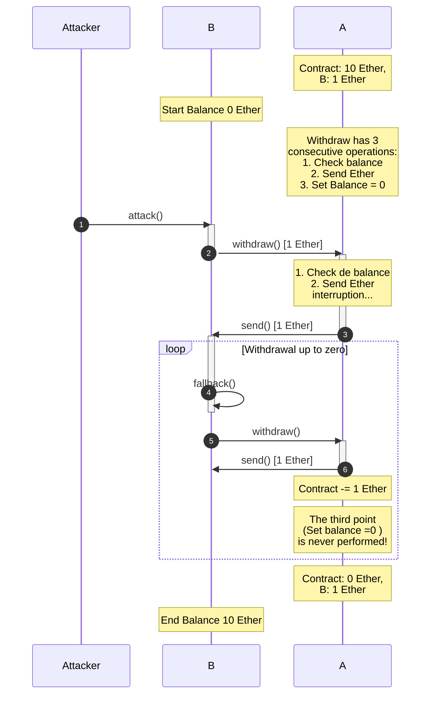

# reentrancy-hack-solidity
This project want to study how the reentrancy exploit works and how to protect from it.

```mermaid
sequenceDiagram
    autonumber
    participant Attacker
    participant B
    participant A
    Note over A: Contract: 10 Ether, <br/> B: 1 Ether
    Note over B: Start Balance 0 Ether
    Note over A: Withdraw has 3  <br/> consecutive operations: <br/> 1. Check balance <br/> 2. Send Ether <br> 3. Set Balance = 0

    Attacker->>B: attack()
    activate B
    B->>A: withdraw() [1 Ether]
    deactivate B
    activate A
    Note over A: 1. Check de balance <br/> 2. Send Ether <br> interruption...
    A->>B: send() [1 Ether]
    deactivate A
    activate B
    loop Withdrawal up to zero
        B->>B: fallback()
        deactivate B
        B->>A: withdraw()
        activate A
        A->>B: send() [1 Ether]
        deactivate A

    Note over A: Contract -= 1 Ether
    Note over A: The third point <br/> (Set balance =0 )<br/> is never performed!
    end

    Note over A: Contract: 0 Ether, <br/> B: 1 Ether
    Note over B: End Balance 10 Ether

```
